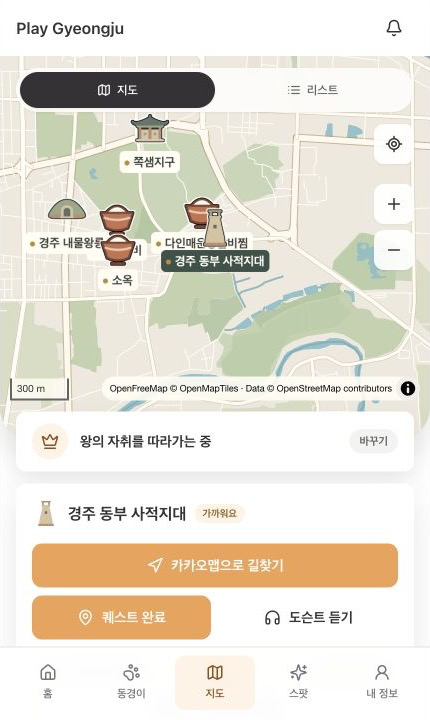
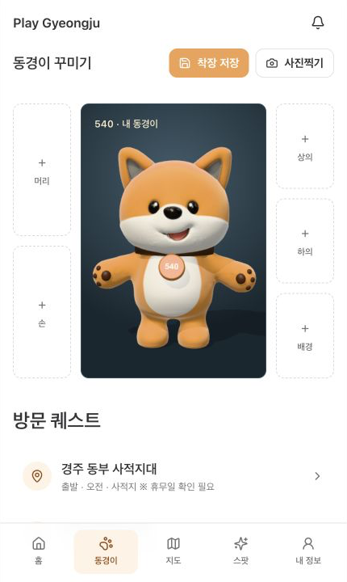
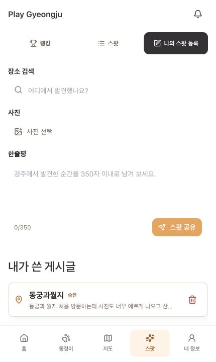
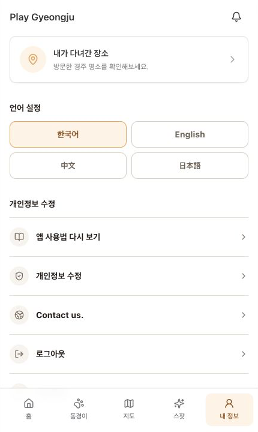
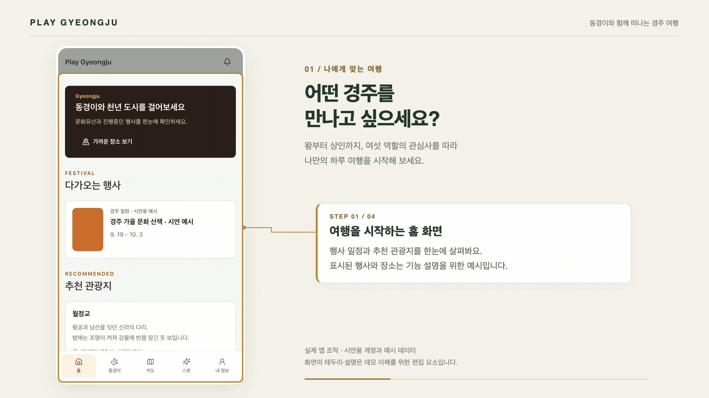
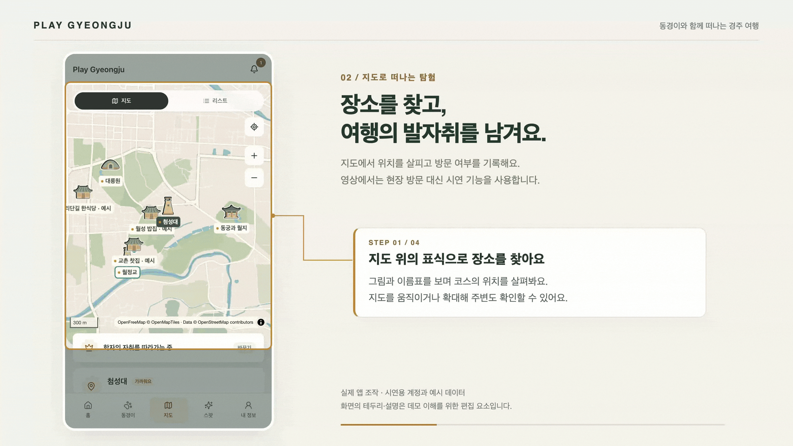
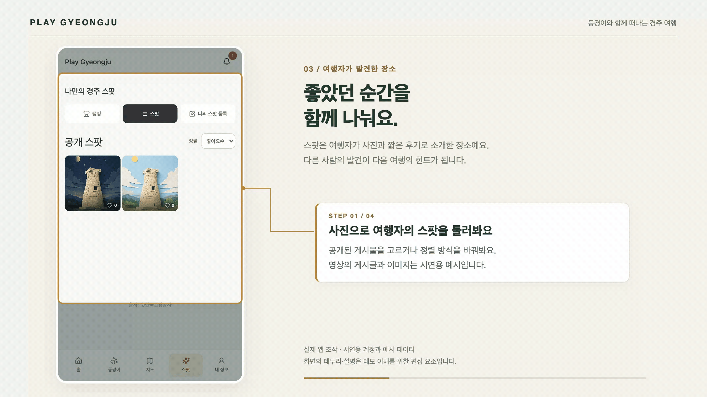
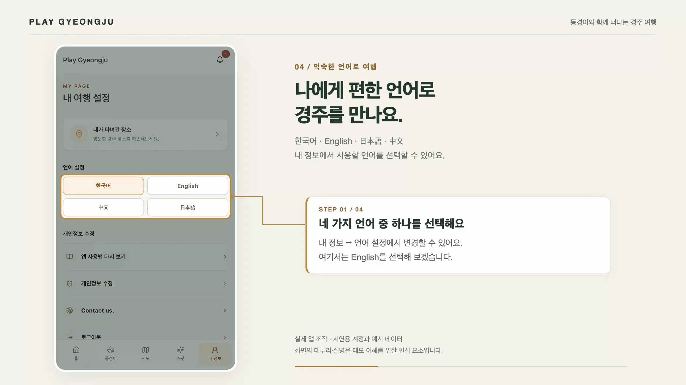

# Play Gyeongju · 플레이 경주

**동경이와 함께, 나만의 이야기로 떠나는 경주 여행.**

경주에는 볼거리도, 걸어볼 길도 많습니다. Play Gyeongju는 “어디부터 가면 좋을까?”라는 고민에서 출발한 여행 서비스입니다. 신라 시대의 역할을 골라 하루 코스를 추천받고, 지도에서 장소를 찾고, 방문한 곳을 기록할 수 있습니다. 방문 보상으로 동경이를 꾸미고, 카메라로 동경이와 함께 사진을 남겨보세요. 여행 중 발견한 장소는 사진과 짧은 후기로 다른 여행자에게 소개할 수 있어요.

**처음 방문하셨나요? 최신 실제 화면과 GIF 네 편으로 주요 기능을 살펴보세요.**

[최신 사용 화면](#최신-사용-화면) · [동경이와 사진찍기](#동경이와-사진찍기) · [방문 보상과 꾸미기](#방문-보상으로-동경이-꾸미기) · [기능 시연 GIF](#짧은-영상으로-둘러보기) · [직접 실행하기](#직접-실행해-보고-싶다면)

## 어떤 서비스를 제공하나요?

| 하고 싶은 일 | Play Gyeongju에서 할 수 있는 일 |
| --- | --- |
| 어디를 갈지 정하고 싶어요 | 홈에서 행사와 추천 관광지를 살펴보고, 여섯 역할 중 하나를 골라 여행 코스를 받아요. |
| 이동 순서와 위치가 궁금해요 | 지도와 리스트를 오가며 관광지·식사 장소의 위치와 방문 순서를 확인해요. |
| 장소까지 가는 길을 알고 싶어요 | 선택한 장소에서 카카오맵 길찾기를 열 수 있어요. |
| 장소의 이야기를 듣고 싶어요 | 설명이 준비된 장소에서는 **도슨트**, 즉 장소를 소개하는 음성 안내를 이용할 수 있어요. 음성 서비스 연결이 필요합니다. |
| 다녀온 곳을 기록하고 싶어요 | 장소 가까이에서 **퀘스트**, 즉 방문 과제를 완료하고, 내 정보의 ‘내가 다녀간 장소’에서 여행 티켓 형태로 기록을 확인해요. |
| 나만의 동경이를 꾸미고 싶어요 | 방문 보상 아이템을 모아 머리·손·상의·하의·배경을 꾸미고 착장을 저장해요. |
| 동경이와 여행 사진을 남기고 싶어요 | 실제 카메라 영상에 3D 동경이를 함께 담아 촬영하고, 사진을 기기에 저장해요. |
| 나만의 발견을 나누고 싶어요 | **스팟**, 즉 여행자가 소개하는 장소를 사진·한줄평으로 공유하고 좋아요·댓글·북마크로 반응해요. 랭킹과 공개 사진 목록도 살펴볼 수 있어요. |
| 다른 언어로 보고 싶어요 | 내 정보에서 한국어, 영어, 일본어, 중국어 중 하나를 선택해요. |
| 여행 중 알림을 확인하고 싶어요 | 상단 종 모양 버튼에서 공지·퀘스트 완료 알림을 확인하고 읽음 상태를 관리해요. |

## 최신 사용 화면

**2026-09-20의 로컬 실행 화면**을 직접 캡처했습니다. 앱 영역만 잘랐으며 화면 내용은 합성하거나 바꾸지 않았습니다. 이미지를 누르면 원본을 볼 수 있습니다.

| 지도와 코스 | 동경이 꾸미기·사진 촬영 진입 |
| --- | --- |
|  |  |

| 스팟 등록 | 내 정보 |
| --- | --- |
|  |  |

### 동경이와 사진찍기

‘동경이’ 탭의 **사진찍기**를 누르면 카메라 화면이 열립니다. 카메라 접근을 허용하면 현재 착용 중인 아이템을 반영한 3D 동경이가 실제 카메라 영상에 함께 나타납니다.

1. 카메라 미리보기에서 나와 동경이의 구도를 확인합니다. 기기가 지원하면 **카메라 전환**으로 전면·후면 카메라를 바꿀 수 있습니다.
2. **촬영**을 누르고 결과를 확인합니다. 마음에 들지 않으면 **다시 찍기**로 돌아갑니다.
3. **사진 저장**을 누르면 `my-donggyeong.png` 파일을 기기에 내려받습니다. 사진은 1080 × 1440 크기이며, 촬영 기능에서 서버로 자동 업로드하지 않습니다.

사진에는 실제 카메라 배경을 사용하므로 꾸미기에서 고른 배경 아이템은 합성하지 않습니다. 카메라는 HTTPS 또는 localhost에서 지원되는 브라우저와 접근 권한이 필요합니다. 위 캡처는 촬영 진입 화면이며, 개인 얼굴과 실내가 담긴 카메라 영상은 문서에 포함하지 않았습니다.

### 방문 보상으로 동경이 꾸미기

코스의 퀘스트를 새로 완료하면 완료 축하 화면에 이어 보상 아이템을 확인할 수 있습니다. 선택한 역할의 아이템은 **머리 → 상의 → 하의 → 손 → 배경** 순으로 지급되며, 이미 완료한 퀘스트를 다시 요청해도 중복 지급되지 않습니다. 해당 역할의 아이템을 모두 받았다면 추가 보상 없이 방문 기록만 남습니다.

‘동경이’ 탭에서 부위를 눌러 획득한 아이템을 착용하거나 해제하고 **착장 저장**을 누르세요. 보유 아이템과 저장한 착장은 로그인 계정·역할별로 불러옵니다. 3D 동경이를 누르면 인사 동작을 볼 수 있고, 아래 방문 퀘스트를 누르면 해당 장소의 지도로 이동합니다. 위 동경이 캡처는 아이템을 착용하지 않은 기본 모습입니다.

### 스팟과 내 여행 기록

스팟은 **랭킹 · 스팟 · 나의 스팟 등록**으로 나뉩니다. 공개 사진 목록에서 게시물을 열어 좋아요·댓글·북마크를 남기고, 좋아요순·신규순으로 정렬할 수 있습니다. 등록 화면에서는 장소 검색, 사진 선택, 350자 이내 한줄평 작성과 내가 쓴 게시글 확인·삭제를 제공합니다. 공개 여부는 검수 상태에 따라 달라집니다.

‘내 정보 → 내가 다녀간 장소’에서는 방문 장소를 여행 티켓 형태로 모아보고, 티켓을 눌러 Google 지도로 위치를 확인할 수 있습니다. 내 정보에는 언어 설정, 사용법 다시 보기, 개인정보 수정, 로그아웃과 회원 탈퇴 메뉴가 있습니다.

## 짧은 영상으로 둘러보기

아래 영상은 **실제 앱을 Playwright로 조작해 녹화한 GIF**입니다. `acd752f` 버전의 시연이므로 최신 화면 배치, 보상 아이템과 사진 촬영은 위 설명·캡처를 참고하세요. 각 영상은 30초 이내이며, 원본 해상도는 **2560 × 1440(QHD)**입니다. 화면에서 밝게 남겨둔 부분과 금색 테두리가 지금 살펴볼 곳이고, 옆 설명 카드는 해당 기능을 풀어 설명합니다. 이 강조 표시는 영상에 덧붙인 안내입니다. **글자가 작게 보이면 영상을 눌러 원본을 열어보세요.**

> **시연 환경 안내**: 별도의 로컬 시연용 계정과 DB를 사용했습니다. 영상의 코스·행사·게시글은 기능을 보여주기 위한 예시이며, 행사 일정이나 식당 정보는 실제 여행 안내로 사용하지 마세요. 게시물에는 시연용 일러스트를 사용했습니다. GIF에는 소리가 포함되지 않습니다.

### 1. 내 취향에 맞는 여행 코스

**영상 속 상황:** 여행을 시작하기 전에 홈을 둘러보고, 역할 선택 화면에서 왕과 학자를 비교합니다. 학자를 선택한 뒤 리스트에서 추천 장소와 방문 순서를 확인합니다.

역할은 여행의 관심사를 정하는 출발점입니다. 왕은 궁궐과 왕릉, 학자는 옛 기록과 유적, 스님은 절과 불상, 화랑은 산길과 계곡, 궁녀는 궁궐과 정원, 상인은 시장과 골목을 중심으로 경주를 바라봅니다. 추천 코스에는 관광지뿐 아니라 식사 장소도 포함됩니다. 실제 추천 결과는 준비된 장소 데이터와 선택한 역할에 따라 달라집니다.

### 2. 지도에서 찾고, 방문 기록 남기기

**영상 속 상황:** 지도 위 장소의 위치를 살펴본 뒤, 아래로 내려가 선택한 장소의 길찾기·도슨트·방문 완료 버튼을 확인합니다. 이어서 **‘예비용 · 방문 완료 체험’**을 눌러 완료 상태를 저장하고 축하 화면을 확인합니다.

실제 여행에서는 위치 권한을 허용하고 장소 반경 100m 안에서 방문을 완료합니다. 위치 측정 정확도도 100m 이하여야 합니다. 영상은 현장 방문 없이 기능을 보여주는 시연이므로 별도의 체험 버튼을 사용했습니다. 길찾기는 카카오맵으로 연결되며, 영상에서는 외부 길찾기 실행이나 음성 재생까지 보여주지는 않습니다.

### 3. 여행자가 발견한 장소 함께 보기

**영상 속 상황:** 공개 스팟의 이미지 목록에서 게시물을 열고 사진과 한줄평을 읽습니다. 좋아요와 북마크를 누르면 하트 수와 버튼 상태가 바뀝니다. 마지막에는 ‘나의 스팟 등록’을 열어 작성 화면을 살펴봅니다.

나도 장소를 검색해 선택하고, 사진과 짧은 후기를 더해 공유할 수 있습니다. 게시물에는 댓글을 남길 수 있고, 공개 목록에서는 좋아요순·신규순으로 정렬할 수 있습니다. 영상은 **작성 화면을 여는 단계까지** 보여주며, 새 게시물을 등록하는 장면은 포함하지 않습니다. 게시물의 공개 여부는 검수 상태에 따라 달라질 수 있습니다.

### 4. 익숙한 언어로 이용하기

**영상 속 상황:** ‘내 정보 → 언어 설정’에서 English를 선택합니다. 설정 화면과 홈의 안내 문구가 영어로 바뀌는 것을 확인한 뒤 다시 한국어로 돌아옵니다.

사용할 언어는 언제든 바꿀 수 있습니다. 장소 정보에 번역이 준비되어 있으면 선택한 언어로 보여주고, 번역이 없는 정보는 한국어 원문으로 표시될 수 있습니다. 일부 화면에는 아직 한국어로 고정된 문구가 남아 있습니다.

## 처음 이용할 때의 흐름

1. **로그인하기** — 아이디와 비밀번호로 로그인합니다. 처음이라면 회원가입부터 진행하세요. 간편 로그인은 해당 서비스의 연결 설정이 필요합니다.
2. **사용법과 역할 살펴보기** — 처음 표시되는 안내를 따라 주요 메뉴를 익히고 관심 있는 역할을 고릅니다.
3. **코스 따라 여행하기** — 지도 또는 리스트에서 장소를 선택하고, 길찾기와 장소 안내를 이용합니다.
4. **방문하고 보상 받기** — 장소 가까이에서 방문 과제를 완료하고 동경이 아이템을 모읍니다.
5. **동경이와 사진 남기기** — 획득한 아이템으로 꾸미고 착장을 저장한 뒤 사진찍기를 이용합니다.
6. **발견을 공유하고 기록 돌아보기** — 스팟에 사진과 한줄평을 공유하고 ‘내 정보’에서 방문 장소를 확인합니다. 언어 변경과 사용법 다시 보기도 이용할 수 있습니다.

## 현재 구현 범위와 이용 조건

이 프로젝트는 계속 개발 중입니다. 최신 기능 설명은 현재 구현을 기준으로 하며, GIF와 최신 캡처의 제작 범위는 [화면·데모 제작 정보](docs/demos/README.md)에 구분해 두었습니다.

- **여행 코스와 방문 완료**는 서버와 관광지 데이터가 필요합니다. 데이터가 비어 있거나 서버에 연결되지 않으면 샘플 장소가 표시될 수 있습니다.
- **지도·장소 검색·길찾기·음성 안내**는 인터넷과 연결된 외부 서비스의 상태·설정에 영향을 받습니다. 앱 안에서 도보 경로를 그리는 기능은 별도의 TMAP 연결이 필요합니다.
- **동경이 보상·착장 저장**은 로그인과 서버 연결이 필요합니다. 3D 표시에는 WebGL을 지원하는 브라우저가 필요하고, 사진 촬영에는 카메라 접근 권한이 필요합니다.
- **스팟 기능 일부**는 개발용 사용자 기준으로 동작합니다. 실제 공개 서비스로 운영하려면 로그인 계정과의 연결을 마무리해야 합니다.
- 관광지 설명·행사 정보는 한국관광공사 데이터 등을 활용합니다. 지도에는 OpenFreeMap·OpenMapTiles·OpenStreetMap의 출처 표시가 포함됩니다. 실제 방문 전에는 운영시간과 행사 일정을 다시 확인해 주세요.

## 직접 실행해 보고 싶다면

현재 이 저장소는 **내 컴퓨터에 개발 환경을 준비해 실행하는 방식**을 안내합니다. 서비스를 이해하는 데에는 위 화면과 영상만으로 충분하며, 설치하거나 코드를 읽을 필요는 없습니다. 기본 Docker 구성은 팀에서 설정한 운영 DB에 연결하므로, 실행 전 [Docker 운영 DB 연결 안내](docs/docker.md)를 확인해 주세요.

직접 실행하려는 분은 아래 문서를 참고해 주세요.

- [Docker 운영 DB 연결 안내](docs/docker.md) — 현재 기본 실행 방식과 환경 설정
- [개발 환경 참고](docs/development.md) — 로컬 실행·문제 해결 참고. 이전 로컬 DB 구성 설명이 포함되어 있습니다.
- [화면 개발 안내](frontend/README.md) — 사용자에게 보이는 화면 실행 방법
- [서버·데이터 안내](backend/README.md) — 관광 데이터 준비, 서버 실행과 관리 방법
- [화면·데모 제작 정보](docs/demos/README.md) — 최신 캡처와 기존 영상의 제작 기준·확인 범위
- [레드팀·보안 검토](docs/redteam/README.md) — 격리된 공격 테스트 실행과 미해결 보안 이슈

기술 구성: 화면은 Next.js·React, 서버는 FastAPI, 데이터 저장은 MySQL을 사용합니다.
